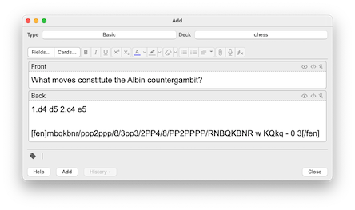
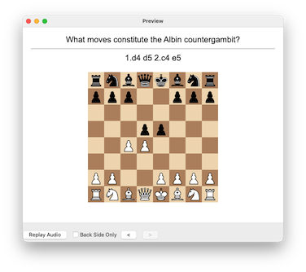

# anki-fen-vis

This is an [Anki](https://apps.ankiweb.net/) plugin to place chess boards in cards with [FEN](https://en.wikipedia.org/wiki/Forsyth%E2%80%93Edwards_Notation) notation:

It's tested on Anki version 2.1.54. It's a spiritual successor to:

| name                                                         | date       | ANKI version |
| ------------------------------------------------------------ | ---------- | ------------ |
| FEN chess visualizer 2.1 ([ankiweb](https://ankiweb.net/shared/info/807548099)) | 2019-03-02 | 2.0, 2.1     |
| FEN chess visualizer ([ankiweb](https://ankiweb.net/shared/info/2923601993)) ([github](https://ospalh.github.io/anki-addons/FEN_visualizer.html)) | 2016-11-29 | 2.0          |

AnkiWeb link: [https://ankiweb.net/shared/info/841766736](https://ankiweb.net/shared/info/841766736)

# developer notes

This works by intercepting card text (using the API provided hook `gui_hooks.editor_will_munge_html`), looking for `[FEN]...[/FEN]`. Upon finding it, [python-chess](https://pypi.org/project/chess/) is used to render an SVG which is substituted into the card text.

Since this git repository name has dashes in it, its default directory upon cloning will also have dashes. If you want to install/uninstall via symlinks (see Makefile), this directory should be named `anki_fen_vis` instead.

Package python-chess 1.9.3 is bundled here because there's no way with Anki addons to express dependencies on PyPI packages.

* https://addon-docs.ankiweb.net/hooks-and-filters.html
* https://addon-docs.ankiweb.net/addon-config.html
* https://addon-docs.ankiweb.net/sharing.html
